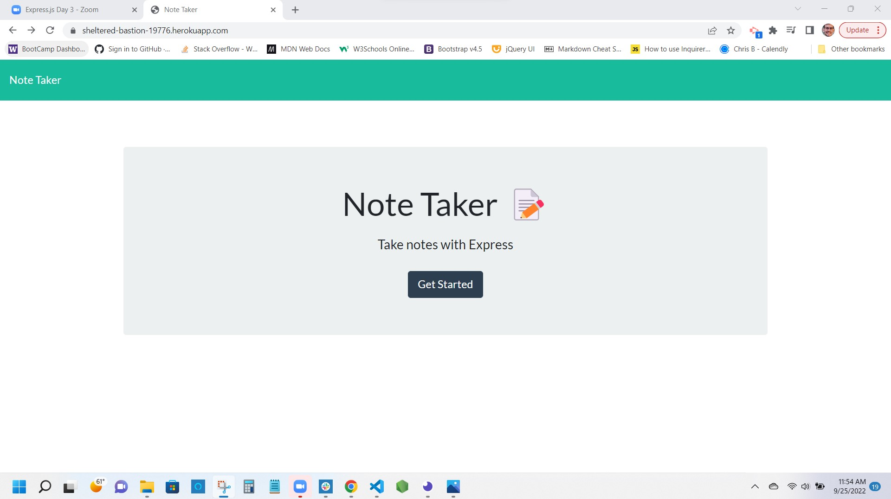
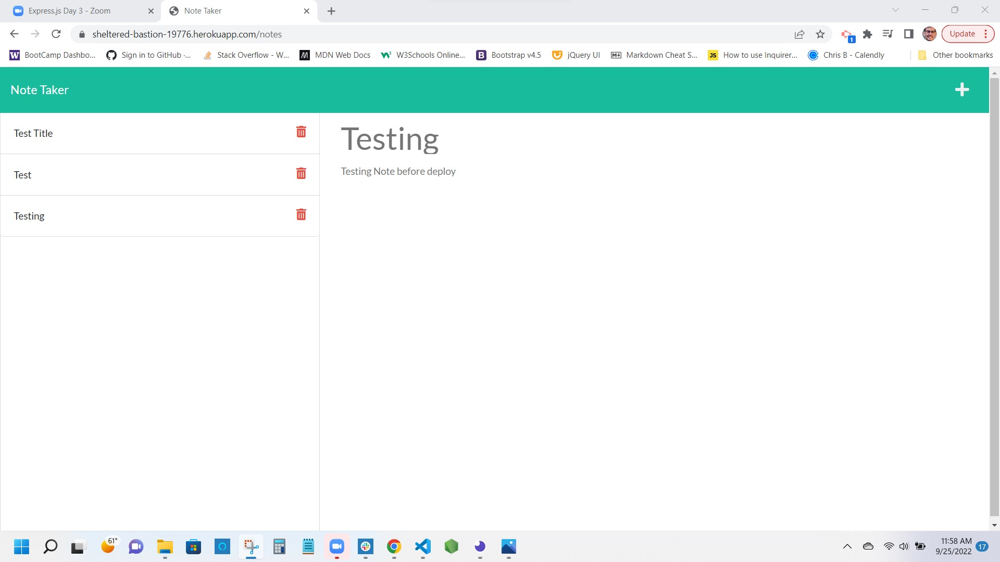

# UW Coding Bootcamp Module 11 Note Taker

This application uses express to stage a server on the backend with a GET and POST route that allows users to create notes in an html page on the frontend.

GitHub Repo: https://github.com/snovelli1021/NoteTaker2

Heroku Deploy: https://sheltered-bastion-19776.herokuapp.com/

Deployed Screenshot:

